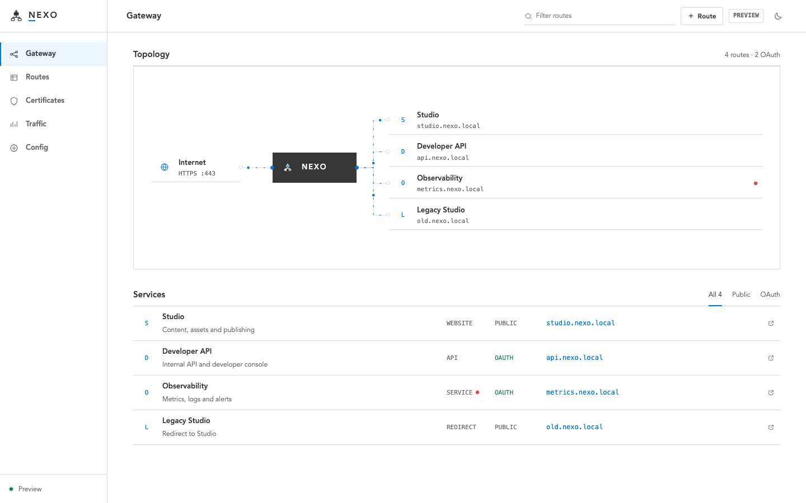

# Nexo

**A small, sharp HTTPS reverse proxy with automatic certificates and a built-in control plane.**

Nexo maps domains to upstream services or HTTPS redirects, obtains certificates through Cloudflare DNS-01, and keeps day-to-day operations visible through a self-contained Web UI.



## Why Nexo

- **Automatic HTTPS** — individual and wildcard certificates through Let's Encrypt and Cloudflare DNS-01.
- **Simple routing** — reverse proxy or redirect configuration in one YAML file.
- **Operational UI** — routes, certificate health, traffic telemetry, and security settings.
- **Optional GitHub OAuth** — per-route access control with an explicit user allowlist.
- **Secure defaults** — loopback-only management UI, CSRF protection, login throttling, strict cookies, security headers, and protected secret storage.
- **Single binary** — templates and assets are embedded; no frontend build pipeline or CDN dependency.

## Preview the UI

The preview uses fake in-memory data. It does not read your config, contact Cloudflare, request certificates, write application data, or bind port 443.

```bash
go run . preview
```

Open these pages:

| Page | URL |
| --- | --- |
| Dashboard | <http://127.0.0.1:8088/> |
| Routes | <http://127.0.0.1:8088/proxies> |
| Certificates | <http://127.0.0.1:8088/certs> |
| Traffic | <http://127.0.0.1:8088/traffic> |
| Configuration | <http://127.0.0.1:8088/config> |
| Login | <http://127.0.0.1:8088/login> |
| Not found | <http://127.0.0.1:8088/404> |

Use a different loopback port when needed:

```bash
go run . preview --addr 127.0.0.1:9090
```

Preview mode intentionally refuses non-loopback addresses.

## Quick start

### Requirements

- Go 1.25.12 or newer, or Docker
- A domain managed by Cloudflare
- A Cloudflare API token with `Zone / DNS / Edit` and `Zone / Zone / Read`

### 1. Create a configuration

```yaml
email: ops@example.com
base_dir: /etc/nexo
cert_dir: /etc/nexo/certs

cloudflare:
  api_token: your-cloudflare-api-token

wildcards:
  - "*.example.com"

webui:
  host: 127.0.0.1
  port: "8080"
  username: admin
  password: "$2a$10$replace-with-a-bcrypt-hash"

security:
  rate_limit_enabled: true
  rate_limit_requests: 100
  rate_limit_window: 60
  max_login_attempts: 5
  login_lockout_minutes: 30
  ip_blacklist:
    - 192.0.2.10
    - 2001:db8::/32

proxies:
  api.example.com:
    upstream: http://127.0.0.1:9000

  old.example.com:
    redirect: https://www.example.com
```

Generate the Web UI password hash:

```bash
make password
```

See [`example/config.yaml`](example/config.yaml) for OAuth and additional route examples.

### 2. Start Nexo

```bash
go run . server --config ./config.yaml
```

Nexo serves configured domains on `:443`. The management UI is available at <http://127.0.0.1:8080> by default.

The root command remains an alias for `server`:

```bash
go run . --config ./config.yaml
```

## Docker

```bash
docker build -t nexo .

docker run --rm \
  --name nexo \
  -p 443:443 \
  -p 127.0.0.1:8080:8080 \
  -v /etc/nexo:/etc/nexo \
  nexo server --config /etc/nexo/config.yaml
```

Inside a container, set `webui.host: 0.0.0.0` so the published loopback port can reach the process. Always configure a bcrypt password and keep the Web UI behind a trusted HTTPS gateway, SSH tunnel, or private network.

## Routing

### Reverse proxy

```yaml
proxies:
  app.example.com:
    upstream: http://127.0.0.1:3000
```

Streaming routes (SSE, long-lived responses) work out of the box because Nexo
does not cap the total response write time by default. Optional per-route
timeouts are available for routes that need them:

```yaml
proxies:
  api.example.com:
    upstream: http://127.0.0.1:3000
    # write_timeout: "2m"             # total response write cap; empty/"0" = unlimited
    # response_header_timeout: "30s"  # wait for upstream headers; "0" = wait indefinitely
    # retry: true                     # retry once on pre-response errors (GET/HEAD/OPTIONS only)
```

- `write_timeout` and `response_header_timeout` accept Go duration strings
  (e.g. `5m`, `30s`). A global `write_timeout` at the top level applies to all
  routes unless a route overrides it; both default to disabled.
- `retry` is opt-in and safe by construction: it retries only idempotent
  methods and never re-sends POST/PUT/PATCH bodies.
- Avoid `write_timeout` on WebSocket routes; a total write cap is incompatible
  with hijacked long-lived connections.

### HTTPS redirect

```yaml
proxies:
  old.example.com:
    redirect: https://www.example.com
```

### Gateway directory metadata (optional)

Nexo publishes proxy routes in the gateway directory without additional configuration. It probes the configured upstream, classifies HTML applications and JSON/OpenAPI services, and discovers standard HTML icon links. Discovery results are cached. If no icon is found, the route uses the first letter of its display name. Connection failures, timeouts, and 5xx responses add a small red availability marker.

Redirects and registrable apex domains are not published by default. Add a `portal` block to publish one explicitly.

Use `portal` when a route needs custom presentation, ordering, visibility, or an explicit service kind:

```yaml
proxies:
  studio.example.com:
    upstream: http://127.0.0.1:4173
    portal:
      name: Studio
      description: Content, assets and publishing
      icon: auto
      kind: website
      group: workspace
      order: 10
      hidden: false
```

`icon` accepts `auto`, a root-relative path, or an HTTP(S) URL. `kind` accepts `website`, `api`, or `service`; omit it to use automatic detection. Set `hidden: true` to keep a route active without listing it on the gateway dashboard.

### GitHub OAuth protection

```yaml
auth:
  auth_host: auth.example.com
  secret_key: "" # generated on first start
  session_ttl: 24h
  github:
    client_id: your-client-id
    client_secret: your-client-secret
    allowed_users:
      - your-github-username

proxies:
  admin.example.com:
    upstream: http://127.0.0.1:9001
    auth: true
```

`allowed_users` is fail-closed: an empty list allows nobody.

## Security model

- The Web UI binds to `127.0.0.1` unless explicitly configured otherwise.
- A passwordless Web UI is forced back to loopback even if a public bind address is configured.
- Config files containing API tokens and OAuth secrets are atomically written with mode `0600`.
- State-changing Web UI actions require POST and a CSRF token.
- Session cookies are HTTP-only, strict same-site, and secure when served through HTTPS.
- OAuth redirects must use HTTPS and match a configured host.
- IP throttling and blacklists use the actual peer address; untrusted forwarding headers are ignored.
- Dynamic, authenticated, and cookie-setting upstream responses are never changed into public-cacheable responses.

If you expose the Web UI beyond localhost, terminate HTTPS at a trusted gateway and restrict network access. A password over public plain HTTP is still a password sent over public plain HTTP—do not do that.

## Development

```bash
# Run tests
go test ./...

# Include the race detector
go test -race ./...

# Static checks
go vet ./...

# Build
go build ./...

# Vulnerability scan
go run golang.org/x/vuln/cmd/govulncheck@latest ./...
```

For local domain and certificate testing, see [`LOCAL_DEV.md`](LOCAL_DEV.md).

## Project layout

```text
.
├── internal/server/   HTTPS listener, reloads, routing orchestration
├── internal/webui/    management handlers, templates, fake-data preview
├── pkg/auth/          GitHub OAuth and signed sessions
├── pkg/cert/          ACME and certificate storage
├── pkg/config/        YAML configuration
├── pkg/proxy/         reverse proxy and cache policy
└── pkg/traffic/       bounded traffic telemetry and persistence
```

## License

MIT
